# [Discovering Statistics Using R] Ch6. correlation
##20150826. by niceov@gmail.com


####[네이버 지식백과] 상관계수 [correlation coefficient] (교육평가용어사전, 2004. 5. 31., 학지사)

표준화된 두 변수 간의 공변하는 관계를 나타내는 통계량이다. 일반적으로는 영국의 통계학자 피어슨(K. Pearson, 1857-1936)이 개발한 피어슨 적률상관계수(product moment correlation)를 가리키는 명칭이다. 이것은 선형적 관계를 나타내며 －1과 ＋1 사이에 있고 아래의 공식으로 계산된다.

상관계수는 상관되는 변수들의 성질에 따라 종류가 다양하다. Pearson의 적률상관계수는 두변수가 수량변수(연속변수)일 때 사용한다. 그러나 두 변수 모두 자연스런 이분변수일 때의 파이계수(phi coefficient), 두 변수가 모두 자연스런 다분변수일 때의 스피어만 서열상관(Spearman rank order correlation), 하나의 수량변수와 다른 하나의 자연스런 이분변수 간의 점이연상관(point-biserial correlation), 수량변수와 자연스런 다분변수 간의 점다연상관(point-polyserial correlation)은 모두 피어슨 적률상관계수의 공식을 간편화시켜서 계산하므로 피어슨상관계열(Pearsonian correlations)이라 한다.

피어슨 상관계열이 아닌 특수상관은 －1과 ＋1의 범위를 벗어나며, 사분상관(tetrachoric correlation), 이연상관(biserial correlation), 다연상관(poly-serial correlation) 등이 있다.

상관계수의 종류 참고 사이트
[link](http://dohwan.tistory.com/394)

<hr>

install.packages('ggplot2') 
install.packages('Hmisc')  
install.packages('ggm')  
install.packages('polycor')  
install.packages('boot')  

##이훈영 교수의 통계학 제3판


```r
img <- list()
img <- paste0("image/f16-",c(1:14),".jpg")
imglist <- NULL
for (i in c(1:14)) imglist <- paste0(imglist, " ", "", sep="")
```

##'r imglist'  <- 사진리스트에 따라 사진들을 출력하는 코드.
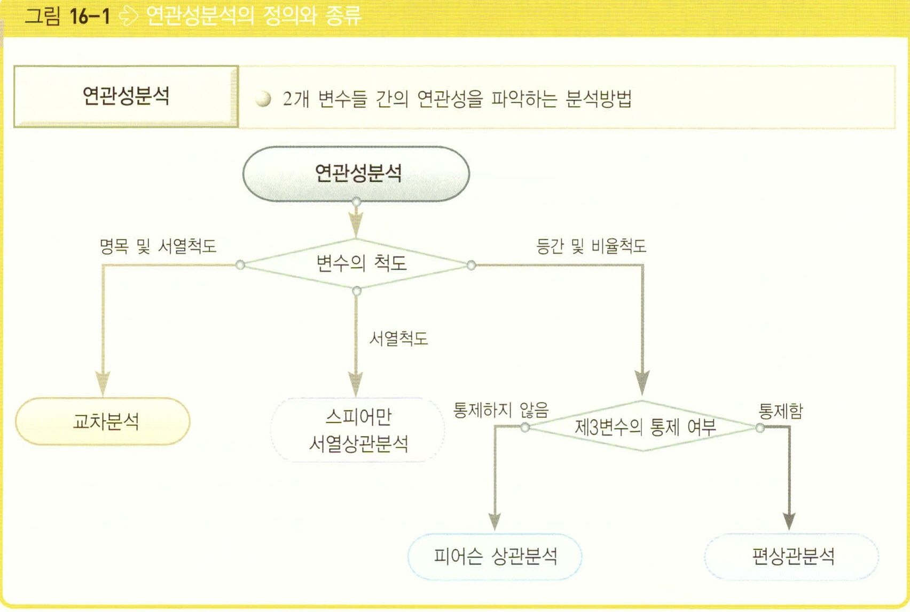 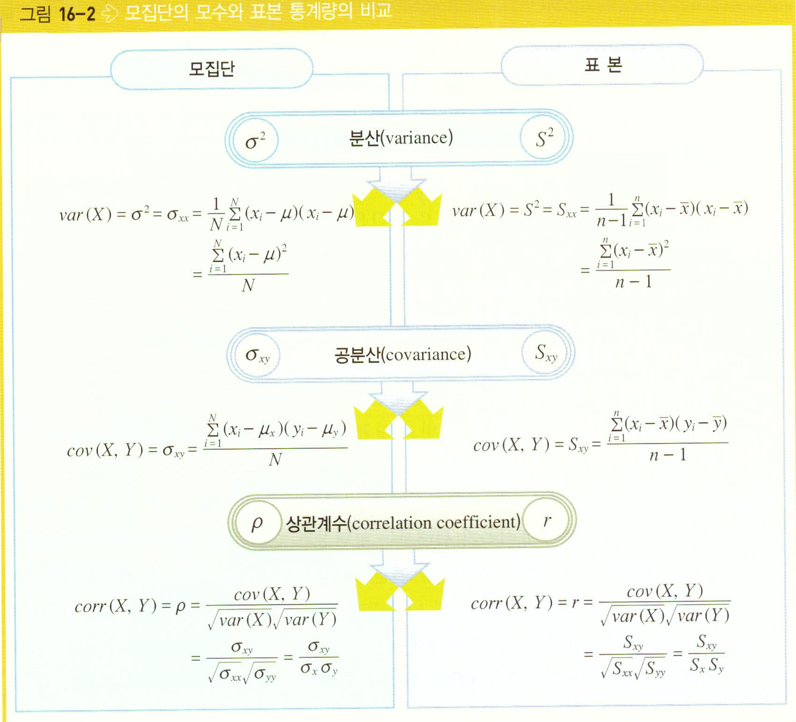  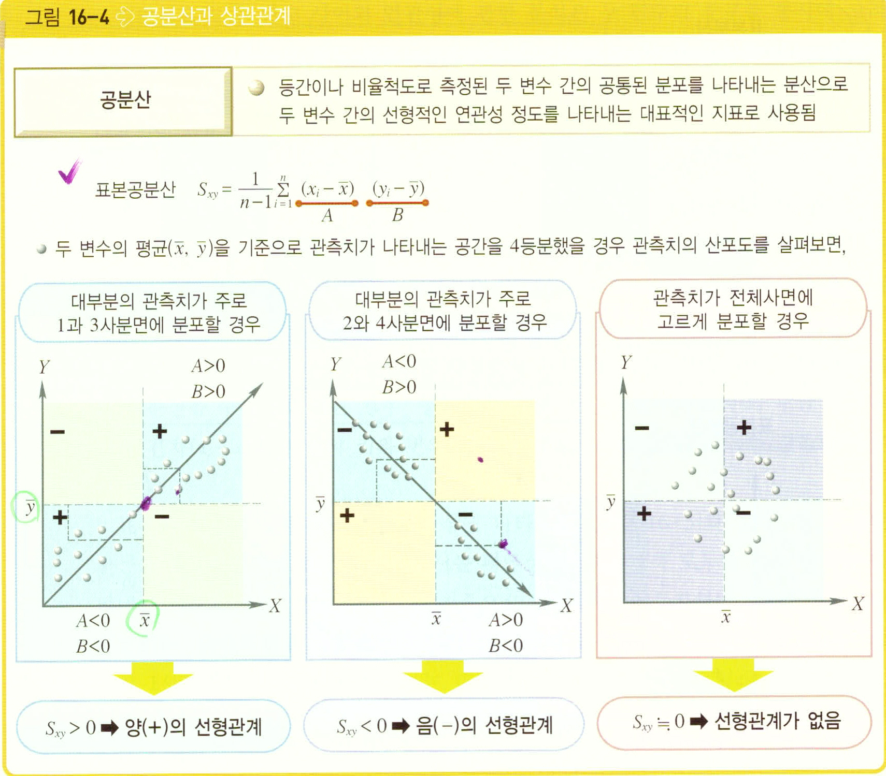 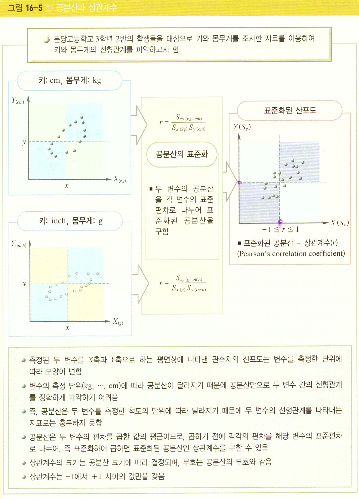 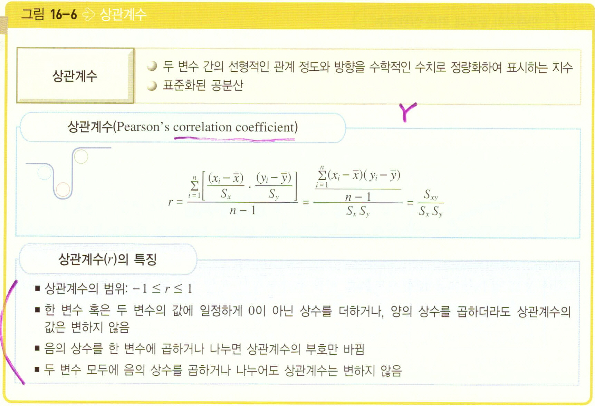 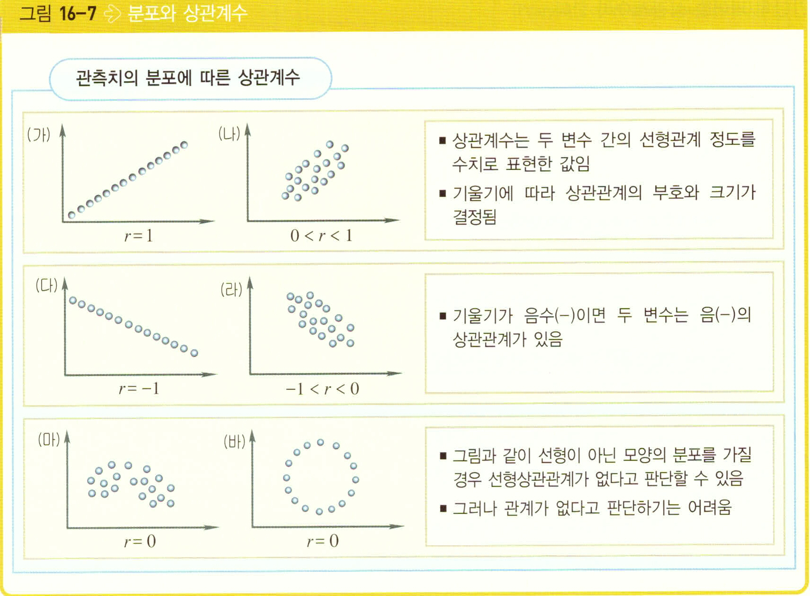 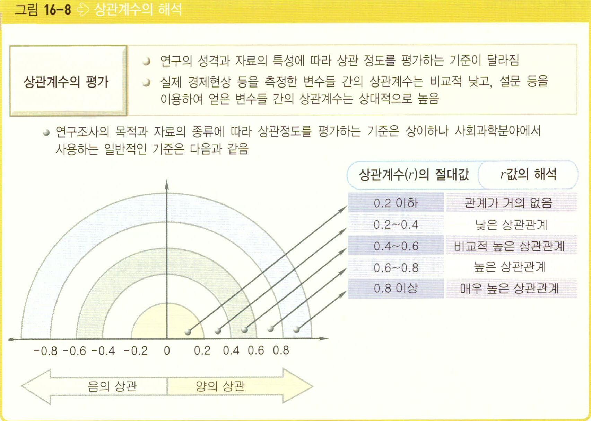 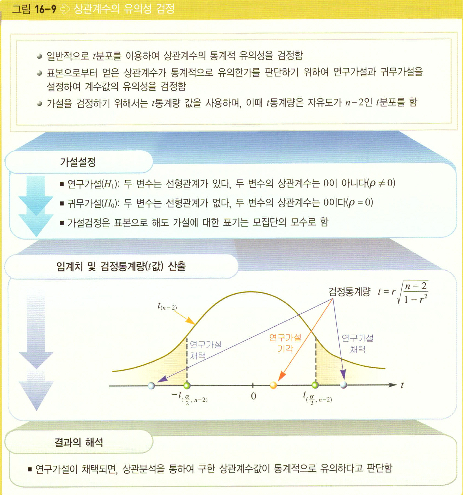 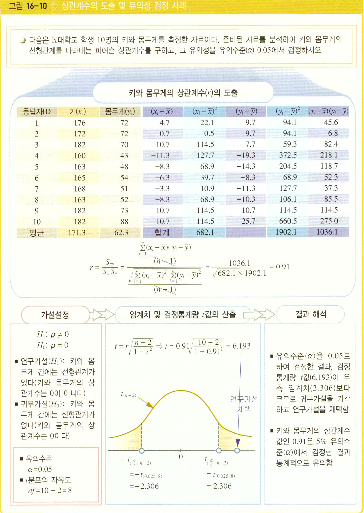 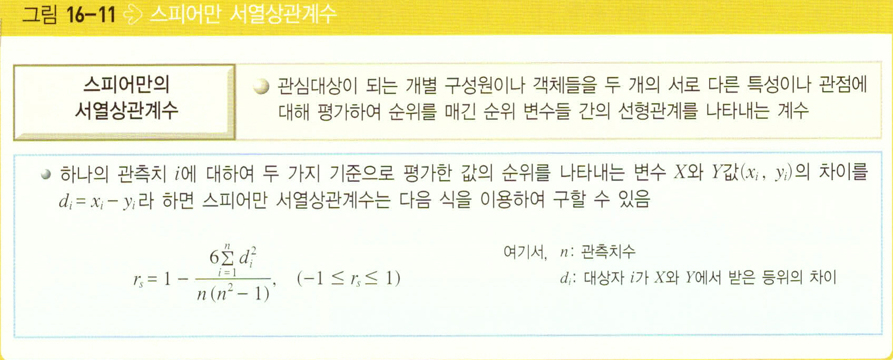  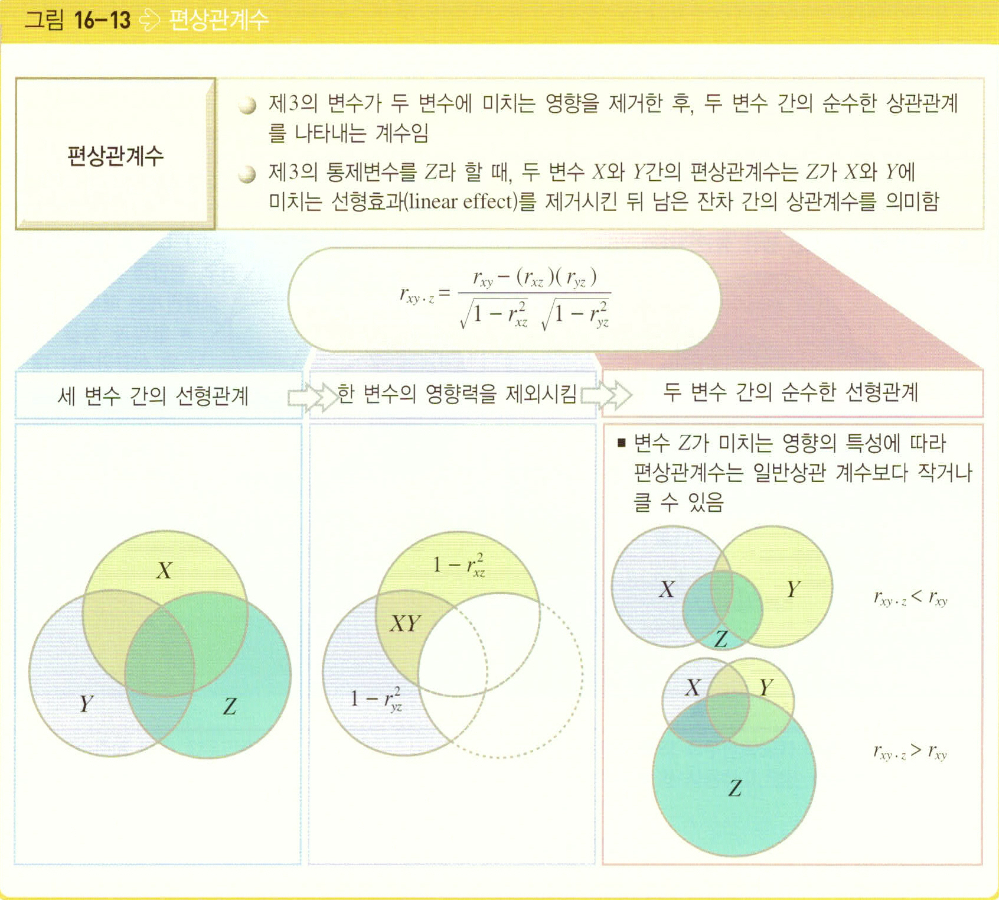 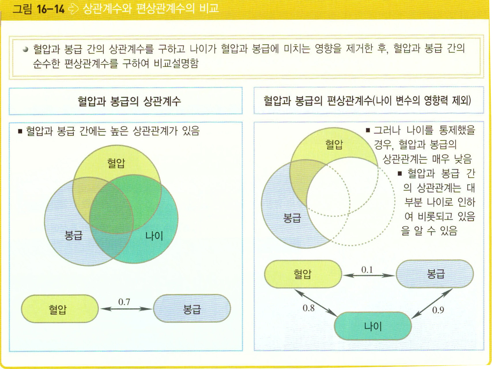 

<hr>


```r
library(ggplot2) #ggplot()
library(ggm) #rcorr() 함수 있으나 지저분한 결과 나온다고 함. pcor()
library(Hmisc) #rcorr() 이 library 추천하고 있음.
library(polycor)
library(boot)
```

RBGL이 없다고 뜨는 경우
###source("http://bioconductor.org/biocLite.R"); biocLite(c("graph","RBGL","Rgraphviz"))


###6.5. 이변량 상관분석(이변수 상관분석, Bivariate correlation)
###103명의 시험점수와 불안감(시험 보기 전)과의 상관관계
pearson: 연속 또는 등간및 비율척도 상관계수  
spearman or kendall: 순위상관계수  
cor()는 상관계수만 보여주고, rcorr()는 상관계수와 함께 n과 p-value 보여주나 kendall안됨.  
####cor.test()는 모든 걸 보여주고 모든게 됨. p216 Table 6.2 참조.  


```r
E = read.delim("6correlation data/Exam Anxiety.dat", header = T)
head(E)
```

```
##   Code Revise Exam Anxiety Gender
## 1    1      4   40  86.298   Male
## 2    2     11   65  88.716 Female
## 3    3     27   80  70.178   Male
## 4    4     53   80  61.312   Male
## 5    5      4   40  89.522   Male
## 6    6     22   70  60.506 Female
```

```r
###cor(E, use = 'complete.obs', method = 'pearson') #error
cor(E$Exam, E$Anxiety, use = 'complete.obs', method = 'pearson')
```

```
## [1] -0.4409934
```

```r
cor(E$Exam, E$Anxiety, use = 'complete.obs', method = 'kendall')
```

```
## [1] -0.2847919
```

```r
cor(E$Exam, E$Anxiety, use = 'pairwise.complete.obs', method = 'kendall')
```

```
## [1] -0.2847919
```

```r
rcorr(E$Exam, E$Anxiety, type = 'pearson')
```

```
##       x     y
## x  1.00 -0.44
## y -0.44  1.00
## 
## n= 103 
## 
## 
## P
##   x  y 
## x     0
## y  0
```

```r
###rcorr(E, type = 'pearson') #error
```

####cor.test는 상관계수의 유의성 검정. 

```r
cor.test(E$Exam, E$Anxiety, method = 'pearson')
```

```
## 
## 	Pearson's product-moment correlation
## 
## data:  E$Exam and E$Anxiety
## t = -4.938, df = 101, p-value = 3.128e-06
## alternative hypothesis: true correlation is not equal to 0
## 95 percent confidence interval:
##  -0.5846244 -0.2705591
## sample estimates:
##        cor 
## -0.4409934
```

```r
cor.test(E$Exam, E$Anxiety, alternative = 'less', method = 'pearson')
```

```
## 
## 	Pearson's product-moment correlation
## 
## data:  E$Exam and E$Anxiety
## t = -4.938, df = 101, p-value = 1.564e-06
## alternative hypothesis: true correlation is less than 0
## 95 percent confidence interval:
##  -1.0000000 -0.2995071
## sample estimates:
##        cor 
## -0.4409934
```

```r
cor.test(E$Exam, E$Anxiety, alternative = 'less', method = 'pearson', conf.level = .99)
```

```
## 
## 	Pearson's product-moment correlation
## 
## data:  E$Exam and E$Anxiety
## t = -4.938, df = 101, p-value = 1.564e-06
## alternative hypothesis: true correlation is less than 0
## 99 percent confidence interval:
##  -1.0000000 -0.2362782
## sample estimates:
##        cor 
## -0.4409934
```

###6.5.4. 피어슨 상관계수
이 파트는 세 변수 이상의 상관계수를 공부.  
rcorr()는 matrix형태(수치변수만) 받음.  

```r
E2 = E[,c('Revise', 'Exam', 'Anxiety')]
cor(E2)
```

```
##             Revise       Exam    Anxiety
## Revise   1.0000000  0.3967207 -0.7092493
## Exam     0.3967207  1.0000000 -0.4409934
## Anxiety -0.7092493 -0.4409934  1.0000000
```

```r
EMatrix = as.matrix(E[,c('Revise', 'Exam', 'Anxiety')])
rcorr(EMatrix)
```

```
##         Revise  Exam Anxiety
## Revise    1.00  0.40   -0.71
## Exam      0.40  1.00   -0.44
## Anxiety  -0.71 -0.44    1.00
## 
## n= 103 
## 
## 
## P
##         Revise Exam Anxiety
## Revise          0    0     
## Exam     0           0     
## Anxiety  0      0
```

```r
#cor.test(E$Exam, E$Anxiety) 중복된 것. rcorr(변수 세 개)로 가능.
#cor.test(E$Revise, E$Anxiety) 중복된 것. rcorr(변수 세 개)로 가능.
```
####결과해석: 불안감 크면 성적 낮게 나온다. 시험공부(revise)시간 길면 성적 높게 나온다. 시험공부시간 길면 불안감은 낮다.

###6.5.4.3. $r^{2}$ 결정계수, coefficient of determination.

```r
cor(E2)^2 #상관계수 제곱한 것.
```

```
##            Revise      Exam   Anxiety
## Revise  1.0000000 0.1573873 0.5030345
## Exam    0.1573873 1.0000000 0.1944752
## Anxiety 0.5030345 0.1944752 1.0000000
```
####결과해석: 불안감과 성적의 r=-0.441, $r^{2}$ = 0.194 이면, 불안감은 성적 변동성의 19.4%를 설명한다. 80.6%는 다른 변수들에 의해 변동성이 설명된다.

###6.5.5. 스피어만 상관계수
비모수(모집단 분포 신경 안 씀) 상관분석  

* Spearman's rank correlation rho: 순위상관계수 0에서 멀어지면 변수 간의 순위가 관련있다는 것임.  
표본크기 10이상에서 95% 신뢰도 양측 검정이면 z>1.96(p<0.05)이면 변수가 서로 독립(rho=0)이라는 귀무가설 기각.  
* kentall's tau(small data set이거나, 같은 rank 값이 많이 있을 때)


###6.5.5. Spearman's rank correlation rho for non parametric
거짓말 대회 등수(position)와 그 사람의 창의력(설문조사함, creativity)

```r
liarData = read.delim('6correlation data/The Biggest Liar.dat', header = T)
head(liarData)
```

```
##   Creativity Position Novice
## 1         53        1      0
## 2         36        3      1
## 3         31        4      0
## 4         43        2      0
## 5         30        4      1
## 6         41        1      0
```

```r
cor(liarData$Position, liarData$Creativity, method = 'spearman')
```

```
## [1] -0.3732184
```

```r
liarMatrix = as.matrix(liarData[,c('Position','Creativity')])
rcorr(liarMatrix)
```

```
##            Position Creativity
## Position       1.00      -0.31
## Creativity    -0.31       1.00
## 
## n= 68 
## 
## 
## P
##            Position Creativity
## Position            0.0111    
## Creativity 0.0111
```

```r
#단측검정: 대립가설(H1, alternative)을 rho<0 이다로 설정하고 검정. 귀무가설은 rho>=0 인데, p<0.05이므로 귀무가설을 기각함.
cor.test(liarData$Position, liarData$Creativity, method = 'spearman', alternative ='less')
```

```
## Warning in cor.test.default(liarData$Position, liarData$Creativity, method
## = "spearman", : Cannot compute exact p-value with ties
```

```
## 
## 	Spearman's rank correlation rho
## 
## data:  liarData$Position and liarData$Creativity
## S = 71948, p-value = 0.0008602
## alternative hypothesis: true rho is less than 0
## sample estimates:
##        rho 
## -0.3732184
```

```r
#창의력(creativity)높아서 거짓말을 잘할수록 position(1이 1등임)은 낮아져야 하니까
```

###6.5.6. Kendall's tau for non parametric

```r
cor(liarData$Position, liarData$Creativity, method = 'kendall')
```

```
## [1] -0.3002413
```

```r
cor.test(liarData$Position, liarData$Creativity, method = 'kendall', alternative = 'less')
```

```
## 
## 	Kendall's rank correlation tau
## 
## data:  liarData$Position and liarData$Creativity
## z = -3.2252, p-value = 0.0006294
## alternative hypothesis: true tau is less than 0
## sample estimates:
##        tau 
## -0.3002413
```

###6.5.7. 부트스트래핑 상관분석(bootstrapping correlations)
부트스트랩(bootstrap) 또는 부트스트래핑은 "현재 상황에서 어떻게든 한다"는 뜻이다. 또, 사물의 초기 단계에서 단순 요소로부터 복잡한 체계를 구축하는 과정을 가리키는 경우도 있다.

[네이버 지식백과] 부트스트랩법 [bootstrap method, ~法] (생명과학대사전, 초판 2008., 개정판 2014., 도서출판 여초)

자료를 통해 얻은 통계량의 표본오차를 확률분포의 가정을 두지 않고 논파라메트릭적으로 평가하기 위한 방법의 하나. 잭나이프법이나 무작위화 검정과 같이 컴퓨터 사용을 전제로 한 새로운 통계방법의 하나이다. 주어진 데이터 세트를 원래의 모집단을 대표하는 독립표본으로 가정하고, 그 자료로부터의 중복을 허용한 무작위 재추출을 컴퓨터로 복수의 자료를 작성하여 각각에서 얻은 통계량(부트스트랩반복)을 계산한다.

그리고 얻어진 복수의 통계량의 오차분산을 구한다. 부트스트랩법은 생물학에서의 사용도 차차 확산되어 가고 있지만 특히 계통추정론 분야에서는 계통수의 신뢰성을 평가할 목적으로 널리 사용하고 있다. 개개의 형질을 자료점이라고 생각하고, 관찰된 형질집합을 1,000회 내지 10,000회 정도 부트스트랩하여 각각의 형질집합으로부터 계통수를 추정한다. 얻어진 복수의 계통수 전체에서 가지(단계통군)의 출현율(부트스트랩확률)을 계산한다. 출현율이 높은 가지(가령 90% 이상)일수록 신뢰할 수 있는 단계통군을 반영한다고 볼 수 있다.


```r
#bootstrapping correlation, spearman과 pearson에 대해서도 적용 가능.
#i는 i번째 bootstrapping set을 의미함.
bootTau <-  function(liarData, i){
cor(liarData$Position[i], liarData$Creativity[i], method = 'kendall', use = 'complete.obs')
}

boot_kendall <-  boot(liarData, bootTau, 2000)  #object 생성: boot(data, function, replications)
boot_kendall
```

```
## 
## ORDINARY NONPARAMETRIC BOOTSTRAP
## 
## 
## Call:
## boot(data = liarData, statistic = bootTau, R = 2000)
## 
## 
## Bootstrap Statistics :
##       original        bias    std. error
## t1* -0.3002413 -0.0001254467  0.09731686
```

```r
boot.ci(boot_kendall) #95% confidence interval
```

```
## Warning in boot.ci(boot_kendall): bootstrap variances needed for
## studentized intervals
```

```
## BOOTSTRAP CONFIDENCE INTERVAL CALCULATIONS
## Based on 2000 bootstrap replicates
## 
## CALL : 
## boot.ci(boot.out = boot_kendall)
## 
## Intervals : 
## Level      Normal              Basic         
## 95%   (-0.4909, -0.1094 )   (-0.4938, -0.1126 )  
## 
## Level     Percentile            BCa          
## 95%   (-0.4878, -0.1066 )   (-0.4765, -0.0910 )  
## Calculations and Intervals on Original Scale
```

```r
boot.ci(boot_kendall, conf = 0.99)
```

```
## Warning in boot.ci(boot_kendall, conf = 0.99): bootstrap variances needed
## for studentized intervals
```

```
## BOOTSTRAP CONFIDENCE INTERVAL CALCULATIONS
## Based on 2000 bootstrap replicates
## 
## CALL : 
## boot.ci(boot.out = boot_kendall, conf = 0.99)
## 
## Intervals : 
## Level      Normal              Basic         
## 99%   (-0.5508, -0.0494 )   (-0.5709, -0.0628 )  
## 
## Level     Percentile            BCa          
## 99%   (-0.5377, -0.0295 )   (-0.5231, -0.0137 )  
## Calculations and Intervals on Original Scale
## Some BCa intervals may be unstable
```
####결과해석: tau는 bootstrap 안한 값이고, 2000개 set의 bias는 0.001로 매우 작다. ci(신뢰구간)도 0을 포함하지 않는다. 결과는 기존 가설 검증이 옳았다는 것을 지지해준다.

###6.5.8. biserial and point-biserial correlation
한 쪽 변수가 양적인 변수(구간, 비율)이고, 다른 쪽 변수는 이진형(binary, dichotomous)일 경우, 두 변수의 관계를 측정할 때 사용된다.

```r
catData = read.csv('6correlation data/pbcorr.csv', header = T)
head(catData)
```

```
##   time gender recode
## 1   41      1      0
## 2   40      0      1
## 3   40      1      0
## 4   38      1      0
## 5   34      1      0
## 6   46      0      1
```

```r
cor.test(catData$time, catData$gender)
```

```
## 
## 	Pearson's product-moment correlation
## 
## data:  catData$time and catData$gender
## t = 3.1138, df = 58, p-value = 0.002868
## alternative hypothesis: true correlation is not equal to 0
## 95 percent confidence interval:
##  0.137769 0.576936
## sample estimates:
##       cor 
## 0.3784542
```

```r
cor.test(catData$time, catData$recode)
```

```
## 
## 	Pearson's product-moment correlation
## 
## data:  catData$time and catData$recode
## t = -3.1138, df = 58, p-value = 0.002868
## alternative hypothesis: true correlation is not equal to 0
## 95 percent confidence interval:
##  -0.576936 -0.137769
## sample estimates:
##        cor 
## -0.3784542
```

```r
###polyserial
catFrequencies = table(catData$gender)
prop.table(catFrequencies)
```

```
## 
##         0         1 
## 0.5333333 0.4666667
```

```r
polyserial(catData$time, catData$recode)
```

```
## [1] -0.4749256
```

###6.6. 편상관분석(부분상관분석, partial correlation)

```r
#구문: pcor(c("var1", "var2", "control1", "control2" etc.), var(dataframe))
pc = pcor(c('Exam', 'Anxiety', 'Revise'), var(E2))
pc
```

```
## [1] -0.2466658
```

```r
pc^2
```

```
## [1] 0.06084403
```

```r
#구문: pcor.test(pcor object, number of control variables, sample size)
pcor.test(pc, 1, 103)
```

```
## $tval
## [1] -2.545307
## 
## $df
## [1] 100
## 
## $pvalue
## [1] 0.01244581
```
####결과해석: 변수 Revise로 통제(조절)하지 않았을 경우 r=-0.441이지만, 통제 후 r=-0.247이다. p-value = 0.012로 0.05보다 작아서 여전히 유의성은 있으나, 상관계수가 반으로 떨어졌다. r^2로 보자면, Exam과 Anxiety가 공유하던 변동성(설명력)은 19.4%에서 6.08%로 떨어졌다. Exam과 Anxiety 그리고 Revision은 복잡하게 얽혀있다는 것을 알 수 있다. 


###6.6.3. 준부분상관분석(준여과상관분석, semi-partial correlation, part correlation)
[link](http://simrihak.tistory.com/83)
준부분상관계수는 예측하고자 하는 준거변인(Y)을 설명하는 예언변인(X1,X2)의 고유한 설명량을 확인할 수 있는 것이다. 
이 책의 hierarchical regression, analysis of covariance을 공부하면 이 내용을 다시 확인할 수 있다. 여기서는 이 정도만 하겠다.


###6.7. 상관계수의 비교(Comparing correlations)
###6.7.1. 독립적인 상관계수 비교(남자와 여자 비교, 서로 독립임)
교과서에 없고, 홈페이지의 Oliver Twisted를 참고하면 나온다. 아래가 그 사이트의 pdf문서임. page 7과 page 10 부근을 참조하면 된다.

[link](http://studysites.sagepub.com/dsur/study/DSUR%20Smart%20Alex-Labcoat%20Leni-Self%20Test%20Answers/DSUR%20Chapter%2006%20Web%20Material.pdf)


```r
maleExam<-subset(E, Gender == "Male", select= c("Exam", "Anxiety"))
femaleExam<-subset(E, Gender == "Female", select= c("Exam", "Anxiety"))
cor(maleExam)
```

```
##               Exam    Anxiety
## Exam     1.0000000 -0.5056874
## Anxiety -0.5056874  1.0000000
```

```r
cor(femaleExam)
```

```
##               Exam    Anxiety
## Exam     1.0000000 -0.3813845
## Anxiety -0.3813845  1.0000000
```

```r
zdifference<-function(r1, r2, n1, n2){
  zd<-(atanh(r1)-atanh(r2))/sqrt(1/(n1-3)+1/(n2-3))  #atanh: arc tangent h(쌍곡삼각함수)
  p <-1 - pnorm(abs(zd))
  print(paste("Z Difference: ", zd))
  print(paste("One-Tailed P-Value: ", p))
}

zdifference(-0.506, -0.381, 52, 51)
```

```
## [1] "Z Difference:  -0.768709306290097"
## [1] "One-Tailed P-Value:  0.221032949510287"
```
####결과해석: z_diff가 -0.768이 나왔는데, 정규분포에서 이에 해당하는 p값은 0.221이고, 양측검정시 0.442이다. 시험에 대한 불안감과 시험 성적의 상관계수는 남녀간에 유의한 차이가 있다고 볼 수 없다. 이경우 n을 52에서 520으로 10배 정도 키우면, 유의한 차이가 있다는 결과가 나온다.

####참고: 상관계수의 차이 검증은 보통 Fisher transformation을 거쳐 z 검증을 실시한다.
r'=0.5*ln(abs((1+r)/(1-r))), z=(r1'-r2')/sqrt((1/(N1-3))+1/(N2-3))
[link](http://jooyeory.blog.me/20191012573)

###6.7.2. 종속적인 상관계수의 비교(불안감과 시험성적의 rxy, 공부시간과 시험성적의 rzy )

```r
tdifference<-function(rxy, rxz, rzy, n){
  df<-n-3
  td<-(rxy-rzy)*sqrt((df*(1 + rxz))/(2*(1-rxy^2-rxz^2-rzy^2+(2*rxy*rxz*rzy))))
  p <-pt(td, df)
  print(paste("t Difference: ", td))
  print(paste("One-Tailed P-Value: ", p))
}

tdifference(-0.441, -0.709, 0.397, 103)
```

```
## [1] "t Difference:  -5.09576822523987"
## [1] "One-Tailed P-Value:  8.21913727738007e-07"
```
####결과해석: t_diff가 -5.09... 가 나왔는데, t분포표에서 자유도100의 95% 신뢰도 지점의 t=1.98이다. 5.09>1.98이므로 상관계수의 차이가 없다는 귀무가설을 기각할 수 있다. 즉, rxy와 rzy는 유의한 차이가 있다고 할 수 있다.

###6.8 effect size의 계산.
r값(correlation coefficient) 자체가 Effect size를 의미한다.

**주의: Caution for non-parametric statistic**

1. Spearman은 순위(rank)를 공유하는 변화량의 정도를 보여주는 것. 정규분포(Normal distribution)에 가까울수록 $r^2$은 pearson만큼 의미가 있다.

2. Kendall tau는 두 변수 간 분산의 공유 정도를 나타내지 않는다. 제곱하여 $tau^2$ 형식으로 사용할 수 없다. 통상 평가자들 간의 점수의 일치도를 의미한다.

3. Kendall tau는 66~75%정도 작기 때문에 Pearson이나 Spearman과 비교할 수 없다.

4. point-biserial/biserial 판단에 따라서 상관정도가 달라질 수 있으므로
변수의 특성을 명확히 파악하여야 한다.

<hr>

##강의에 추가할 것
* 상관분석의 시각화
* 분위회귀분석(quantile regression)


